# Learnify Code

A concise, compelling one-liner that explains what your app does and who it’s for. For example: “A lightweight task manager to help teams plan, track, and deliver projects faster.”

- Homepage: https://your-app-homepage.example.com
- Demo video: https://your-demo-link.example.com
- Issue tracker: https://github.com/your-org/your-repo/issues

## Table of Contents
- [Overview](#overview)
- [Features](#features)
- [Tech Stack](#tech-stack)
- [Getting Started](#getting-started)
- [Project Structure](#project-structure)
- [Screenshots](#screenshots)
- [Roadmap](#roadmap)
- [Contributing](#contributing)
- [License](#license)
- [Acknowledgements](#acknowledgements)

## Overview
Briefly describe the problem your app solves, key use cases, and the target audience. Keep it clear, outcome-focused, and jargon-free.

## Features
- Feature 1: Short benefit-oriented statement
- Feature 2: Short benefit-oriented statement
- Feature 3: Short benefit-oriented statement
- Dark mode / Offline support / Accessibility notes if applicable

## Tech Stack
- Frontend: e.g., React, Next.js, Tailwind CSS
- Backend: e.g., Node.js, Express, PostgreSQL
- Infra/DevOps: e.g., Docker, GitHub Actions, Vercel
- Other: e.g., Auth provider, Analytics, Payments

## Getting Started

### Prerequisites
- Node >= 18 (or your version)
- pnpm | npm | yarn
- Docker (optional)

### Installation
```bash
# clone
git clone https://github.com/your-org/your-repo.git
cd your-repo

# install deps
pnpm install
# or: npm install
```

### Environment
Create a .env file in the project root:
```bash
cp .env.example .env
# then fill in values
```

### Run Locally
```bash
# dev
pnpm dev
# or: npm run dev

# prod
pnpm build && pnpm start
# or: npm run build && npm start
```

### Tests
```bash
pnpm test
# or: npm test
```

## Project Structure
Give readers a quick mental model.
```text
.
├─ src/
│  ├─ components/
│  ├─ pages/            # or app/ if Next.js App Router
│  ├─ lib/
│  ├─ styles/
│  └─ ...
├─ public/
├─ SS/                  # Screenshots folder (PNG files)
├─ .env.example
├─ package.json
└─ README.md
```

## Screenshots
Screenshots are organized in a 4-column grid. Place your PNG images in the SS folder. The example below targets 12 screenshots named 01.png … 12.png. Update names if yours differ (e.g., 1.png, 2.png, …).

<table>
  <tr>
    <td align="center">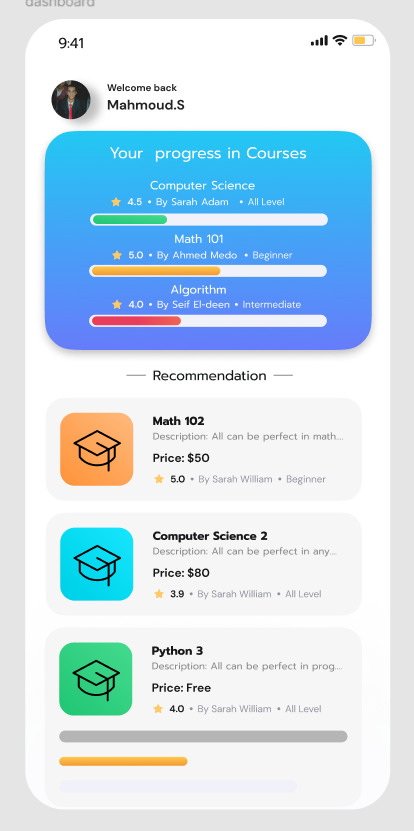<br><sub>Screenshot 1</sub></td>
    <td align="center">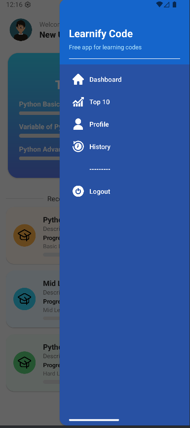<br><sub>Screenshot 2</sub></td>
    <td align="center">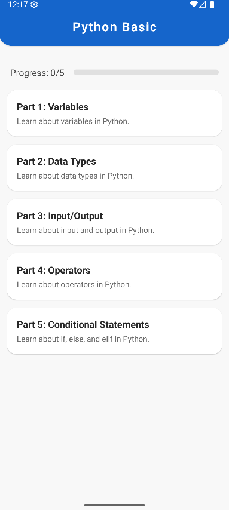<br><sub>Screenshot 3</sub></td>
    <td align="center">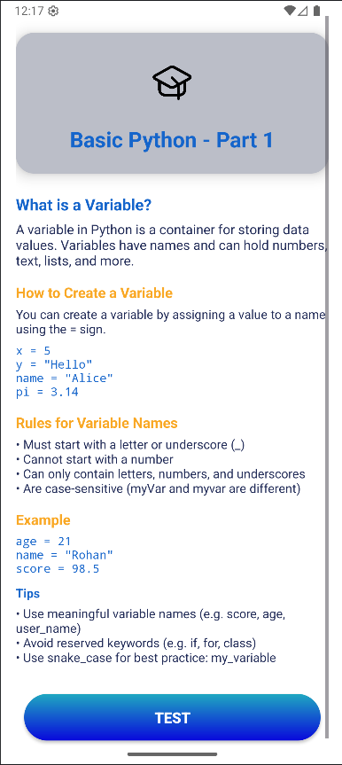<br><sub>Screenshot 4</sub></td>
  </tr>
  <tr>
    <td align="center">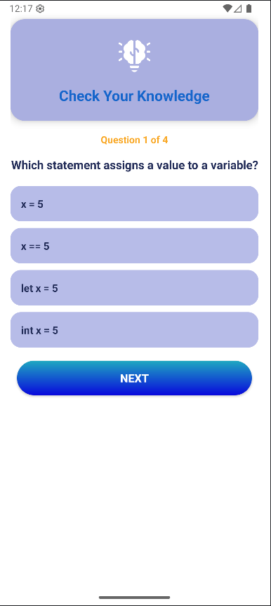<br><sub>Screenshot 5</sub></td>
    <td align="center">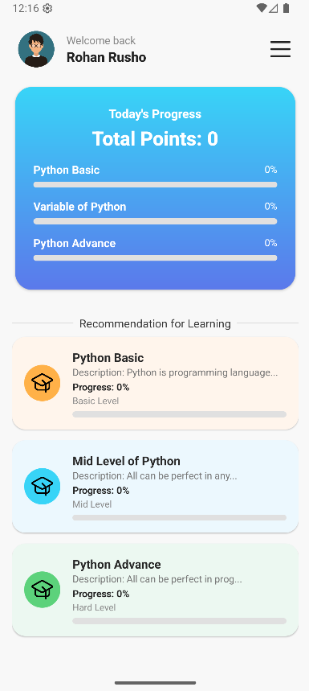<br><sub>Screenshot 6</sub></td>
    <td align="center">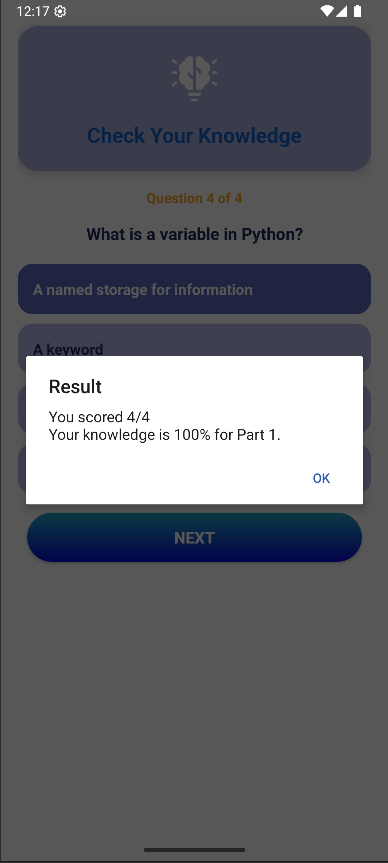<br><sub>Screenshot 7</sub></td>
    <td align="center">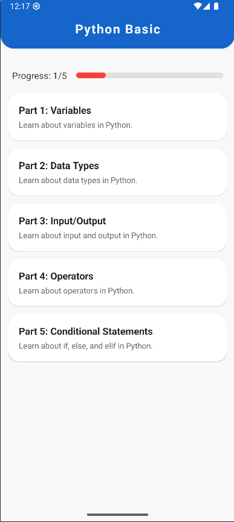<br><sub>Screenshot 8</sub></td>
  </tr>
  <tr>
    <td align="center">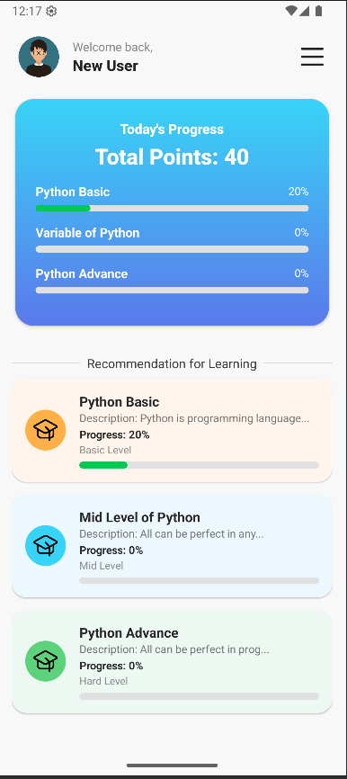<br><sub>Screenshot 9</sub></td>
    <td align="center">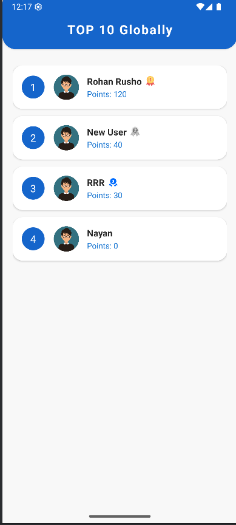<br><sub>Screenshot 10</sub></td>
    <td align="center">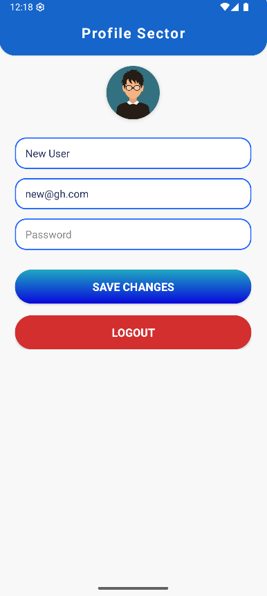<br><sub>Screenshot 11</sub></td>
    <td align="center">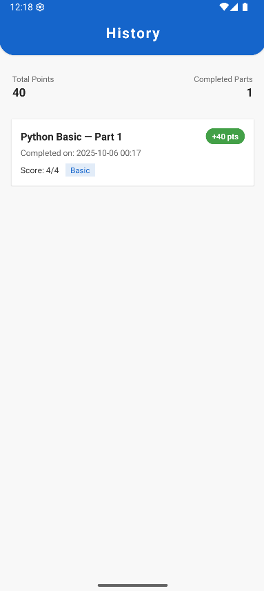<br><sub>Screenshot 12</sub></td>
  </tr>
</table>

Tips:
- Keep consistent file names (e.g., 01.png … 12.png) for easy maintenance.
- Click any image to view it full size on GitHub.
- For more than 12 screenshots, duplicate the last <tr> and continue numbering.

## Roadmap
- [ ] Milestone 1
- [ ] Milestone 2
- [ ] Milestone 3

## Contributing
Contributions are welcome!
1. Fork the repo
2. Create a feature branch
3. Commit changes with clear messages
4. Open a PR describing the change, rationale, and any screenshots

## License
Specify your license here (e.g., MIT). See LICENSE for details.

## Acknowledgements
- Libraries, frameworks, icons, and inspirations you used.
- Shout-outs to contributors and maintainers.
